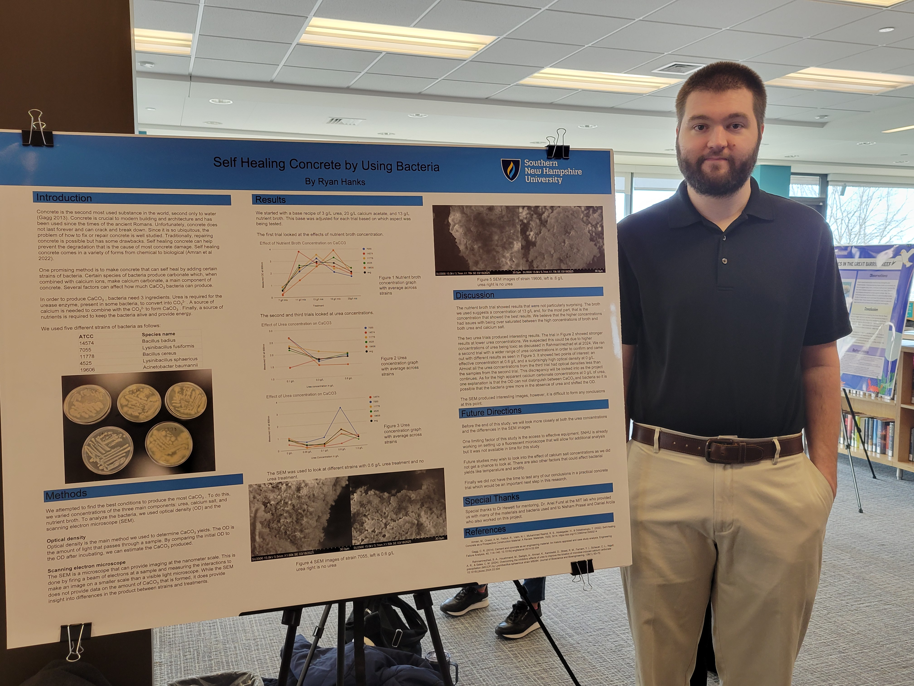

## Ryan Hanks

&nbsp; Biology student  
&nbsp; Southern New Hampshire University  
&nbsp; &nbsp; email: ryan.hanks@snhu.edu 
&nbsp; &nbsp; [Resume](https://docs.google.com/document/d/1eSEH5Ag9OXBhcqWEHigP8qNxedIIUaJO/edit?usp=sharing&ouid=102001016882642290785&rtpof=true&sd=true)

 
 
 
 

### About Me

I am a soon to Biology graduate at SNHU. I have a strong interest in Microbiology and Bioinformatics. 

 
 

### Undergraduate Research 
I participated in an undergraduate research projected focused around self healing concrete. We looked at optimizing bacterial yeild of calcium carbonate by varining urea and nutreint broth concentrations. This [project](<SiteFiles/Bact Poster (2).pdf>) was presented at SNHU undergraduate research day.

 
 
 
 
 
 
 
 
 
 
 
 
 
 

### Sample Work Products
Thoughout my Bioinformatics class we worked on several different project as seen below. 

#### Palmer's Penguins
As an introduction to biostatistics I worked with the Palmer's penguins data set and preformed differnt ways of visualizing and anylizing the data. It can be seen [here](http://twig40k.github.io/BioStatisticsAnalysis/penguinsinital.html).

#### Malaria
Continueing with Biostatistics, I took multible data sets and merged them together in order to look at relations between malaria deaths, cases and country GDP. [here](<https://twig40k.github.io/BioStatisticsAnalysis/malaria comb data.html>)

#### RNA Seq
I started by working with sample data sets to look at RNA seq data and how it can be displayed. I used both a [table](<http://twig40k.github.io/Bioinformatics/rna seq 1.html>) to look at gene comparisions and a [heat map](<http://twig40k.github.io/Bioinformatics/rna seq 2.html>) to look at trends in the data and display it in a readable way.

#### Pylogentic Trees
I took sample data and experimented with differnt ways to make [phylogenetic trees](<http://twig40k.github.io/Bioinformatics/phylo tree 1.html>)

#### Custom Trees
I built a data set from genbank and then walked through the process of alining the sequences, comparing differnces between species and make a [phylogenetic tree](<http://twig40k.github.io/Bioinformatics/bact phylo tree.html>). (WIP)
